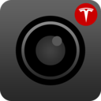
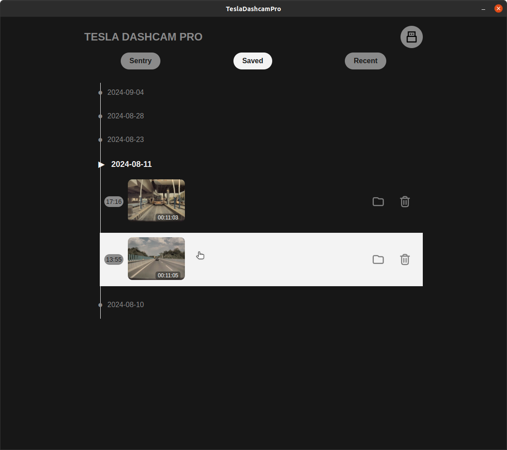
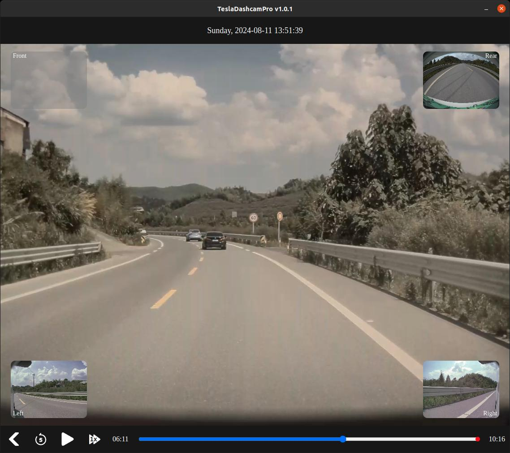

|| [软件安装](./install.md) ||

    
    <h1>Tesla 行车记录仪播放器</h1>

## 开发初衷

_整理行车记录仪，想要查看并保存一些有意义的视频片断时，发现U盘里的行车记录仪是1分钟1个视频文件，1个视角1个视频文件，查看起来较为困难。_

_Github上已有的项目，没有现成的可以直接运行的电脑软件。_

**本项目开发的软件可以在电脑上方便的查看行车记录仪内容，支持MacOS，Windows，Linux系统。**

## 主要特点

播放界面的设计尽量和车机保持了一致，目前支持：

* 读取整个TeslaCam文件夹或者单个文件夹
* 前后左右4路视频同时播放
* 点击切换多个视角
* 时间戳显示
* 进度条点击跳转
* 回退5s
* 倍速播放（1x，2x，4x，8x）
* 显示哨兵和保存的视频片段的触发时间点（进度条上的红点）
* 打开视频所在文件夹位置
* 删除视频

---
---

    <h1>Tesla 行车记录仪增强版</h1>

_图中右上角显示的即为车辆的驾驶信息。_

## 增强版主要功能

1. 突破原车只能保存1小时行车记录仪的限制，U盘越大存的越久
2. 记录车辆驾驶信息，支持常见的信号：
    - 车速
    - 档位
    - 方向盘角度
    - 驾驶状态（AP，ACC，人工）
    - 刹车踏板
    - 加速踏板百分比
    - 转向灯
    - 双闪灯
    - 示宽灯
    - 近光灯
    - 远光灯

更具体的说明在[这里](./pro/README.md)。
