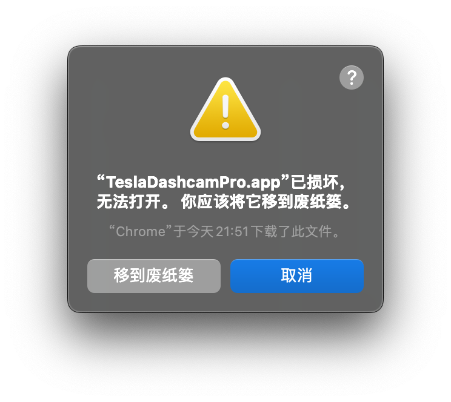

| [English Version](./install_EN.md) |

# 安装

## 方法1：下载编译好的安装包

> 由于Windows上和macOS上只有软件签名的软件才能正常安装（需要一大笔费用），本仓库发布的软件包都没有软件签名，所以**需要用户安装过程中允许安装未知来源的安装包**，具体操作如下。

### 1.1 下载平台对应的安装包

[软件下载地址](https://github.com/JustForFunOk/tesla_dashcam_pro/releases)

### 1.2 安装

#### 1.2.1 Windows 安装
双击下载的.exe安装包，按照如下进行操作，允许安装未知发布者的应用程序。


#### 1.2.2 macOS 安装

1. 将.zip解压后的.app文件复制到/Applications/文件夹下。

2. 打开终端执行
``` bash
sudo spctl --master-disable
sudo xattr -r -d com.apple.quarantine /Applications/TeslaDashcamPro.app
```

3. 从启动台中启动软件，验证可以正常启动

4. 恢复系统安全检查
``` bash
sudo spctl --master-enable
```

命令说明：
* `sudo spctl --master-disable`命令用于在 macOS 系统中禁用 Gatekeeper，这是一项安全功能，用于控制系统是否允许安装和运行非来自 Apple 官方开发者或未经过认证的应用程序。
* `sudo xattr -r -d com.apple.quarantine /Applications/TeslaDashcamPro.app`表示删除名为 com.apple.quarantine 的扩展属性。com.apple.quarantine 属性是 macOS 用来标记那些从网络下载、邮件或外部设备（如 USB 驱动器）复制过来的文件。这个标记会触发系统的警告和额外的安全检查（如文件是否来自可信的开发者或是否被修改过）。
* 若软件启动时出现如下提示则说明上述操作没有成功执行



#### 1.2.3 Linux 安装
* Ubuntu上使用 `sudo dpkg -i xxx.deb` 命令安装。
* CentOS上使用 `sudo rpm -i xxx.rpm` 命令安装。


---


## 方法2：从源代码打包安装

### 2.1 安装node

[官网下载安装](https://nodejs.org/en/download/package-manager)，我使用的是v22.10.0，其他版本应该也可。

### 2.2 安装依赖
下载本仓库源码，然后在本仓库根目录执行
``` bash
npm install
```

### 2.3 打包
在本仓库根目录执行
``` bash
npm run make
```
执行完毕后会在仓库的`./out/make/`目录下生成平台对应的安装包

### 2.4 安装

#### 2.4.1 Windows 安装
直接双击生成的`exe`文件即可安装，安装后会在桌面生成快捷方式。

#### 2.4.2 macOS 安装
直接将生成的`.app文件`复制到`/Applications/`文件夹下即可。

#### 2.4.3 Linux 安装
* Ubuntu上使用 `sudo dpkg -i xxx.deb` 命令安装。
* CentOS上使用 `sudo rpm -i xxx.rpm` 命令安装。
