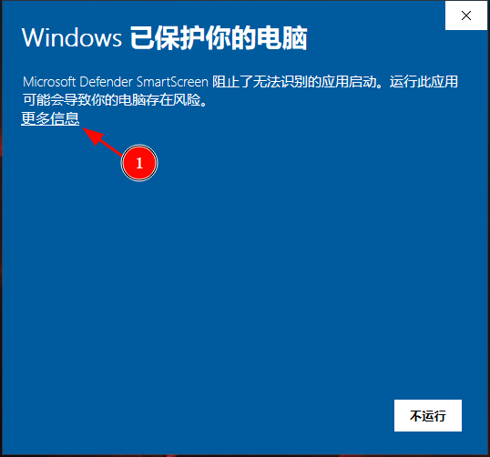

# 安装

## 从源代码打包安装

### 1. 安装node

### 2. 安装依赖
在本仓库根目录执行
``` bash
npm install
```

### 3. 打包
在本仓库根目录执行
``` bash
npm run make
```
执行完毕后会在仓库的/out/make/目录下生成平台对应的安装包

### 4. 安装
<details>
    <summary>Windows 安装</summary>
直接双击生成的exe文件即可安装，安装后会在桌面生成快捷方式。
</details>

<details>
    <summary>macOS 安装</summary>
直接将生成的.app文件复制到/Applications/文件夹下即可。
</details>

<details>
    <summary>Linux 安装</summary>
Ubuntu上使用 <code>sudo dpkg -i xxx.deb</code> 命令安装。</br>
CentOS上使用 <code>sudo rpm -i xxx.rpm</code> 安装。
</details>


---

## 下载安装编译好的安装包

由于Windows上和macOS上需要签名认证才能正常安装，软件签名的费用对于个人免费开源项目难以接受，所以想要安装预编译好的安装包，需要用户允许安装未知来源的安装包，具体操作如下。

<details>
  <summary>Windows 安装</summary>
双击下载好的.exe安装包，按照如下进行操作，允许安装未知发布者的应用程序




</details>

<details>
  <summary>macOS 安装</summary>

</details>

<details>
  <summary>Linux 安装</summary>
Ubuntu上使用 <code>sudo dpkg -i xxx.deb</code> 命令安装。</br>
CentOS上使用 <code>sudo rpm -i xxx.rpm</code> 安装。
</details>


