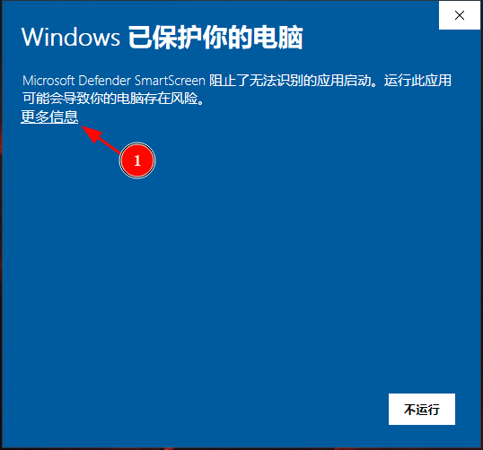
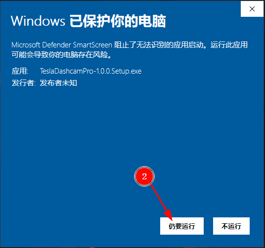
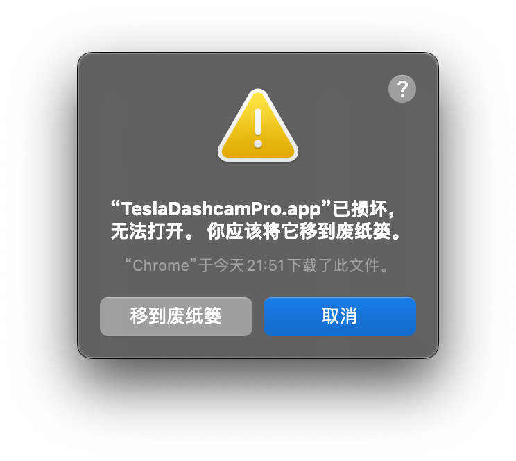

| [中文版本](./install.md) |

# Installation

## Method 1: Download the Precompiled Installation Package

> Due to the requirement for software signing on Windows and macOS (which involves a significant cost), the software packages released in this repository do not have a software signature. Therefore, **users must allow the installation of packages from unknown sources** during installation. The specific steps are as follows:

### 1.1 Download the installation package for your platform

[Download link](https://github.com/JustForFunOk/tesla_dashcam_pro/releases)

### 1.2 Installation

#### 1.2.1 Windows Installation
Double-click the downloaded `.exe` installation package and follow the steps below, allowing the installation of apps from unknown publishers.




#### 1.2.2 macOS Installation

1. Copy the `.app` file extracted from the `.zip` file to the `/Applications/` folder.

2. Open the terminal and execute:
```bash
sudo spctl --master-disable
sudo xattr -r -d com.apple.quarantine /Applications/TeslaDashcamPro.app
```

3. Launch the software from the Launchpad to verify that it runs correctly.

4. Restore system security checks:
```bash
sudo spctl --master-enable
```

Command Explanation:

* `sudo spctl --master-disable` disables Gatekeeper on macOS. Gatekeeper is a security feature that controls whether macOS allows the installation and running of applications from sources that are not from Apple-certified developers or unsigned.
* `sudo xattr -r -d com.apple.quarantine /Applications/TeslaDashcamPro.app` removes the com.apple.quarantine attribute, which macOS uses to mark files downloaded from the internet, email, or external devices (like USB drives). This flag triggers additional security checks, such as verifying if the file is from a trusted developer or has been tampered with.
* If you encounter the following warning when launching the software, it means the previous steps were not successful: 


#### 1.2.3 Linux Installation
* On Ubuntu, use `sudo dpkg -i xxx.deb` to install.
* On CentOS, use `sudo rpm -i xxx.rpm` to install.


---

## Method 2: Install from Source Code

### 2.1 Install Node.js
Download from [official website]((https://nodejs.org/en/download/package-manager)). I am using v22.10.0, but other versions should work as well.

### 2.2 Install Dependencies
Download the source code from this repository, then execute the following command in the root directory of the repository:
``` bash
npm install
```

### 2.3 Build the Package
Run the following command in the root directory of the repository:
``` bash
npm run make
```
After the process completes, the platform-specific installation package will be generated in the `./out/make/` directory.

### 2.4 Installation

#### 2.4.1 Windows Installation
Double-click the generated `.exe` file to install. After installation, a shortcut will be created on the desktop.

#### 2.4.2 macOS Installation
Simply copy the generated `.app` file to the `/Applications/` folder.

#### 2.4.3 Linux Installation
* On Ubuntu, use `sudo dpkg -i xxx.deb` to install.
* On CentOS, use `sudo rpm -i xxx.rpm` to install.